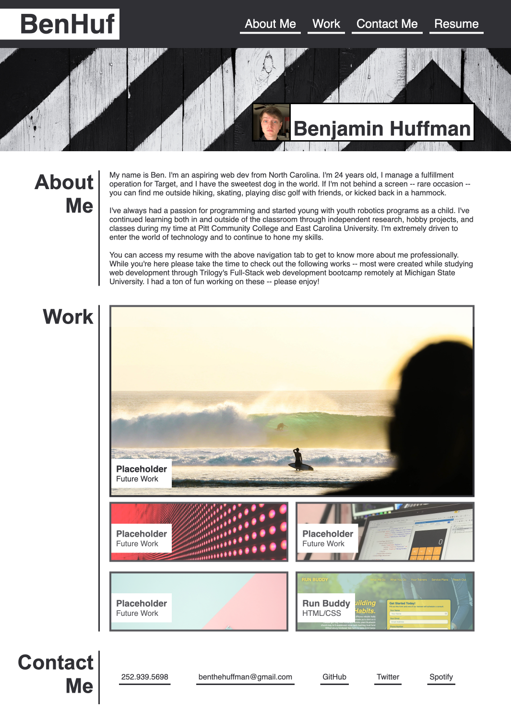

# Portfolio for Benjamin Huffman 

## Purpose
To provide a digital portfolio for potential employers to view previous works

## Built With
* HTML
* CSS

## Website
https://benhuf.github.io/Prof-Portfolio/

## GitHub Page Link
https://github.com/BenHuf/Prof-Portfolio

## Contribution
BenHuf (Benjamin Huffman) https://github.com/BenHuf 
vinaykumar0459 https://jsfiddle.net/user/vinaykumar0459/fiddles/

*Title: Sweep-to-top hover transition* 
*Author: vinaykumar0459* 
*Date: Accessed 04/17/2022* 
*Code Version: 1.0* 
*Availability: https://jsfiddle.net/vinaykumar0459/h4vobaje/* 

Big thanks to Vinay for posting a snippet on how to achieve a sweep-to-top hover animation. I repurposed [this](https://jsfiddle.net/vinaykumar0459/h4vobaje/) snippet to acheive the animation seen on the nav and contact links.

